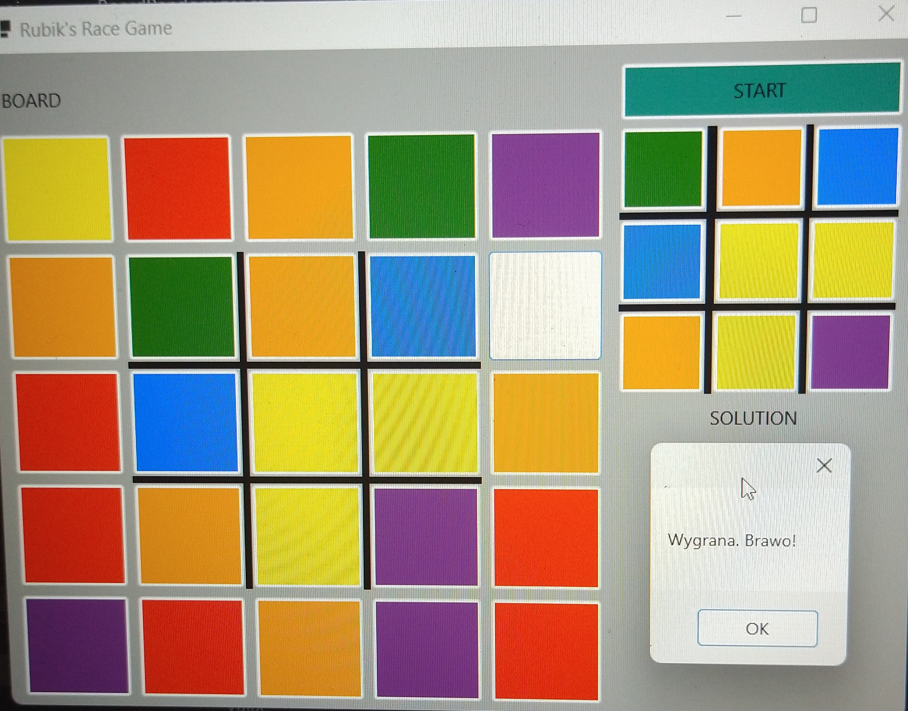

# RubiksRaceGame
See:
```
https://www.bing.com/videos/riverview/relatedvideo?q=RubiksRaceGame&mid=6901C5B47C40032F430B6901C5B47C40032F430B&FORM=VIRE
```
# Sample solution

# TODOs
Modify method for board generation - to have 4 items per each color and 1 transparent field.
Currently it is random, so sometimes You need to restart game couple of times to have the board solvable.
